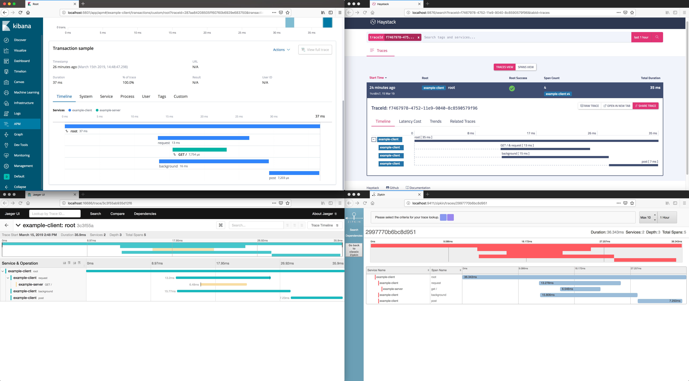

# Opentracing Multiplexer for Go

This is an experiment for duplicating all trace reporting through multiple opentracing tracers within a single go application.
It is not intended for production use.

## Quickstart

```go
import (
	"github.com/graphaelli/otmux"
)

tracer := otmux.NewTracer(elasticOpenTracer, jaegerOpenTracer)
opentracing.SetGlobalTracer(tracer)
```

## Example

[cmd/](cmd) contains an example client and server wired up to:

* [Elastic APM](https://www.elastic.co/solutions/apm)
* [Haystack](https://expediadotcom.github.io/haystack/)
* [Jaeger](http://jaegertracing.io)
* [Zipkin](http://zipkin.io)

An example of the same trace represented across those systems:

